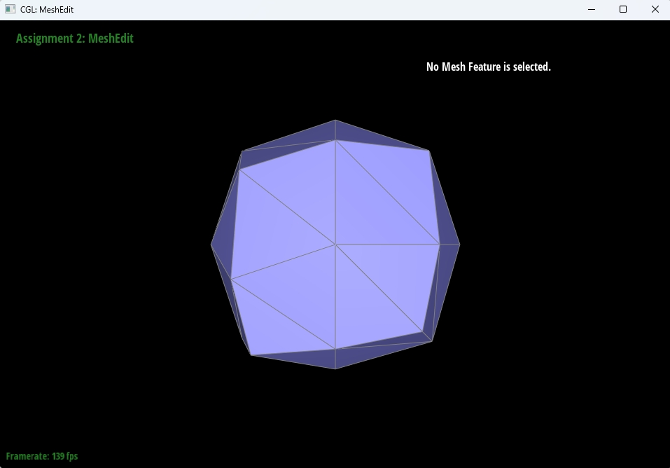

<h1 align = "center">计算机图形学</h1>

<h3 align = "center">课程作业2：网格编辑</h3>

<h4 align = "center">072203231 潘子睿</h4>

### 一、概述

本次实验主要实现了基于 1D de Casteljau 的贝塞尔曲线和曲面，以及通过编写normal、flipEdge、splitEdge、upsample函数来完善贝塞尔曲面的相关功能。其中normal函数实现加权面积法求顶点法线，flipEdge函数实现边翻转的功能，splitEdge函数实现边分割的功能，upsample函数实现网格上采样（Loop Subdivision）。

### 二、贝塞尔曲线和曲面

#### 1、基于 1D de Casteljau 绘制贝塞尔曲线

- de Casteljau 算法是一种用于计算贝塞尔曲线的递归方法。其核心思想是对控制点进行线性插值，直到只剩下一个点作为曲线上某一位置的点。

- 以下是代码的详细解释

  - **初始控制点**：从一组控制点（`currentPoints`）开始，这些点定义了贝塞尔曲线的形状。

  - **线性插值**：在每一步中，使用以下公式在相邻的控制点之间进行插值计算新的点 :
    $$
    (1 - t) \times \text{point}_i + t \times \text{point}_{i+1}
    $$
    其中，`t` 是插值参数，通常在 [0, 1] 范围内变化，用于计算曲线上不同位置的点。

  - **递归处理**：通过对控制点的插值，得到一组新的点。可以重复此步骤，直到只剩下一个点——这个点就是贝塞尔曲线上对应 `t` 的点。

- 代码结果展示

  

- 代码段展示

  ```cmake
   std::vector<Vector2D> BezierCurve::evaluateStep(std::vector<Vector2D> const& points)
   {
       // TODO Part 1.
       std::vector<Vector2D> currentPoints = points;
  
       int n = currentPoints.size();
       std::vector<Vector2D> newPoints;
       for (int i = 0; i < n - 1; i++) {
           newPoints.push_back(currentPoints[i] * (1 - t) + currentPoints[i + 1] * t);
       }
       return newPoints;
   }
  ```

#### 2、基于 1D de Casteljau 绘制贝塞尔曲面

- de Casteljau 算法可以扩展到贝塞尔曲面（Bézier surface），这种曲面通过在二维控制点网格中进行双重插值生成。
- 以下该算法扩展的基本步骤和实现方法
  - **控制点网格**
    - 贝塞尔曲面由多个控制点组成，通常表示为一个二维数组（`controlPoints`）。每个控制点是一个三维向量。
  - **一维插值**
    - 使用 `evaluate1D` 方法对每一行的控制点进行插值。这个方法内部调用 `evaluateStep`，实现对控制点的线性插值，生成中间曲线点。每次调用 `evaluateStep`，将当前的控制点集合减少到一半，直到只剩下一个点。
  - **二维插值**
    - 在 `evaluate` 方法中，首先针对每一行的控制点使用 `evaluate1D` 方法，根据参数 `u` 计算出一组中间曲线点（`curvePoints`）。
    - 然后，利用 `evaluate1D` 方法对中间曲线点进行插值，计算出最终的贝塞尔曲面点，使用参数 `v` 进行插值。

- 代码结果展示

  

- 代码段展示

  ```cmake
  std::vector<Vector3D> BezierPatch::evaluateStep(std::vector<Vector3D> const& points, double t) const
  {
      std::vector<Vector3D> currentPoints = points;
      int n = currentPoints.size();
      std::vector<Vector3D> newPoints;
      for (int i = 0; i < n - 1; i++) {
          newPoints.push_back(currentPoints[i] * (1 - t) + currentPoints[i + 1] * t);
      }
      return newPoints;
  }
  
  Vector3D BezierPatch::evaluate1D(std::vector<Vector3D> const& points, double t) const
  {
      std::vector<Vector3D> currentPoints = points;
      while (currentPoints.size() > 1) {
          currentPoints = evaluateStep(currentPoints, t);
      }
      return currentPoints[0];
  }
  
  Vector3D BezierPatch::evaluate(double u, double v) const
      {
          std::vector<Vector3D> curvePoints;
          for (const auto& row : controlPoints) {
              curvePoints.push_back(evaluate1D(row, u)); 
          }
          return evaluate1D(curvePoints, v);
      }
  ```
  
  

### 三、三角网格和半边数据结构

#### 3、基于面积加权的顶点法线计算

- 面积加权的顶点法线计算通过对与该顶点相邻的所有三角形法线进行加权平均来实现。

- 以下是实现步骤的详细说明

  - **初始化法线**
    - 创建一个法线向量 `normal`，初始值为零向量，作为累加法线的容器。
  - **获取半边**
    - 使用 `halfedge()` 方法获取与该顶点相邻的半边 `h`。
  - **遍历相邻三角形**
    - 使用循环遍历所有与该顶点相邻的三角形。循环从初始半边 `h` 开始，并在完成一个完整的循环后回到起始点 `h_start`。

  - **计算法线**
    - 在每个循环中，获取当前三角形的三个顶点 `p0`、`p1` 和 `p2`。
    - 通过计算两个边的叉积，得到三角形的法线 `face_normal`。由于法线是未归一化的，可以直接使用叉积的结果。

  - **计算面积**
    - 使用法线的模长来计算三角形的面积，面积等于法线模长的一半。

  - **加权法线累加**
    - 将每个三角形的法线乘以其对应的面积，然后累加到 `normal` 中，形成加权法线的总和。

  - **更新到下一个三角形**
    - 使用半边的对偶（`twin()`）和下一个半边（`next()`）移动到下一个三角形的半边。

  - **归一化法线**
    - 循环结束后，对最终的法线向量 `normal` 进行归一化，返回单位法线向量。

- 代码结果展示(前后对比)

  

  

- 代码段展示

  ```cmake
  Vector3D Vertex::normal(void) const
  {
      // TODO Part 3.
      Vector3D normal(0.0, 0.0, 0.0); 
      HalfedgeCIter h = halfedge();   
      HalfedgeCIter h_start = h;
      
      do {
          Vector3D p0 = h->vertex()->position;       
          Vector3D p1 = h->next()->vertex()->position; 
          Vector3D p2 = h->next()->next()->vertex()->position;  
          Vector3D face_normal = cross(p1 - p0, p2 - p0);
          double area = face_normal.norm() / 2.0;
          normal += area * face_normal;
          h = h->twin()->next();
      } while (h != h_start);
  
      return normal.unit();
  }
  ```

#### 4、边翻转(Edge Flip)

- 边翻转操作用于改变网格的拓扑结构，具体来说是通过翻转共享边的两个面，使得新的边连接原先的两个顶点。

- 以下是实现边翻转的步骤说明

  - **获取半边**
    - 从给定的边 `e0` 获取与其关联的半边 `h1` 和 `h2`，其中 `h2` 是 `h1` 的对偶半边。

  - **检查边界条件**
    - 如果任一半边 `h1` 或 `h2` 是边界半边（即处于网格的边界），则不进行翻转，直接返回原边 `e0`。

  - **获取与半边关联的顶点和面**
    - `v1` 和 `v2` 为 `h1` 和 `h2` 的起始顶点；
    - `v3` 和 `v4` 为 `h1` 和 `h2` 的两个对端顶点；
    - `f1` 和 `f2` 为与 `h1` 和 `h2` 相关的面。

  - **获取与 `h1` 和 `h2` 相邻的半边**
    - `h1_next` 和 `h2_next` 为 `h1` 和 `h2` 的下一个半边；
    - `h1_prev` 和 `h2_prev` 为 `h1_next` 和 `h2_next` 的下一个半边。

  - **更新 ` h1 ` 和` h2` 的邻居关系，指向新的顶点和相邻半边**
    - `h1` 的邻居为 `h1_prev`、`h2`、`v4`、原边 `e0` 和面 `f1`；
    - `h2` 的邻居为 `h2_prev`、`h1`、`v3`、原边 `e0` 和面 `f2`。

  - **更新 h1_next和 h2_next 的邻居关系，以保持网格的正确链接**
    - `h1_next` 指向 `h2`、其对偶半边、`v2`、和原边 `e0` 及面 `f2`；
    - `h2_next` 指向 `h1`、其对偶半边、`v1`、和原边 `e0` 及面 `f1`。

  - **更新 `h1_prev` 和 `h2_prev` 的邻居关系**
    - `h1_prev` 的邻居指向 `h2_next`、其对偶半边、`v3`、和面 `f1`；
    - `h2_prev` 的邻居指向 `h1_next`、其对偶半边、`v4`、和面 `f2`。

  - **更新面与半边的关系**
    - 更新 `f1` 和 `f2` 的半边指针，使它们指向新的半边 `h1` 和 `h2`。

  - **返回翻转后的边**
    - 返回翻转后的边 `e0`。

- 代码结果展示（前后对比）

  

  

- 代码段展示

  ```cmake
  EdgeIter HalfedgeMesh::flipEdge(EdgeIter e0)
  {
  
      // TODO Part 4.
      HalfedgeIter h1 = e0->halfedge();
      HalfedgeIter h2 = h1->twin();
  
      if (h1->isBoundary() || h2->isBoundary()) {
          return e0;
      }
      VertexIter v1 = h1->vertex();
      VertexIter v2 = h2->vertex();
      VertexIter v3 = h1->next()->next()->vertex();
      VertexIter v4 = h2->next()->next()->vertex();
  
      FaceIter f1 = h1->face();
      FaceIter f2 = h2->face();
  
      HalfedgeIter h1_next = h1->next();
      HalfedgeIter h2_next = h2->next();
      HalfedgeIter h1_prev = h1_next->next();
      HalfedgeIter h2_prev = h2_next->next();
  
      h1->setNeighbors(h1_prev, h2, v4, e0, f1);
      h2->setNeighbors(h2_prev, h1, v3, e0, f2);
  
      h1_next->setNeighbors(h2, h1_next->twin(), v2, h1_next->edge(), f2);
      h2_next->setNeighbors(h1, h2_next->twin(), v1, h2_next->edge(), f1);
  
      h1_prev->setNeighbors(h2_next, h1_prev->twin(), v3, h1_prev->edge(), f1);
      h2_prev->setNeighbors(h1_next, h2_prev->twin(), v4, h2_prev->edge(), f2);
  
      f1->halfedge() = h1;
      f2->halfedge() = h2;
  
      return e0;
  }
  ```
  
  

#### 5、边分割(Edge Split)

- 边分割操作用于在网格中创建一个新的顶点，将现有的边分为两部分，并将新点和四边形的另外两个顶点连接，创造两个新的边。

- 以下是实现边分割的步骤说明

  **获取相关半边和顶点**

  - 从给定的边 `e0` 获取与其关联的半边 `h0` 和其对偶半边 `h1`；
  - 获取与 `h0` 和 `h1` 相关联的两个顶点 `v0` 和 `v1`。

  **检查边界条件**

  - 如果 `h0` 或 `h1` 是边界半边，则无法进行分割，返回一个空的顶点迭代器。

  **获取与 `h0` 和 `h1` 相邻的半边**

  - `h0_next` 和 `h1_next` 为 `h0` 和 `h1` 的下一个半边；
  - `h0_prev` 和 `h1_prev` 为 `h0_next` 和 `h1_next` 的下一个半边。

  **获取对角顶点**

  - 通过相邻半边获取对角顶点 `v2` 和 `v3`。

  **计算新顶点的位置**

  - 新顶点的位置为 `v0` 和 `v1` 的中点。

  **创建新顶点**：

  - 使用 `newVertex()` 创建新的顶点 `m`，并将其位置设置为计算得到的中点，标记为新顶点。

  **创建新半边和边**

  - 使用 `newHalfedge()` 创建新的半边，分别命名为 `h2`、`h3`、`h4`、`h5`、`h6`、`h7`。
  - 使用 `newEdge()` 创建新的边，分别命名为 `e1`、`e2`、`e3`。

  **创建新面**：

  - 使用 `newFace()` 创建新的面，分别命名为 `f2` 和 `f3`。

  **设置半边的邻居关系**

  - 更新现有半边 `h0` 和 `h1` 的邻居关系，指向新的半边、顶点和面。

  **更新新半边的邻居关系**

  - 设置新创建的半边 `h2`、`h3`、`h4`、`h5`、`h6` 和 `h7` 的邻居关系，确保它们正确连接到新顶点和相邻面。

  **更新顶点和边的半边指针**

  - 更新所有相关顶点 `v0`、`v1`、`v2`、`v3` 和新顶点 `m` 的半边指针，确保指向正确的半边。

  **更新边的半边指针**

  - 更新边 `E`、`e1`、`e2` 和 `e3` 的半边指针，确保它们正确指向新的半边。

  **更新面与半边的关系**

  - 更新与面 `f0`、`f1`、`f2` 和 `f3` 相关的半边指针，确保它们正确连接。

  **返回新顶点**

  - 返回新创建的顶点 `m`。

- 代码结果展示(前后对比)

  

  

- 代码段展示

  ```cmake
  VertexIter HalfedgeMesh::splitEdge(EdgeIter e0)
  {
      // TODO Part 5.
      // 获取与这条边相关的半边和顶点
      HalfedgeIter h0 = e0->halfedge();
      HalfedgeIter h1 = h0->twin();
  
      VertexIter v0 = h0->vertex();
      VertexIter v1 = h1->vertex();
  
      // 检查是否是边界边
      if (h0->isBoundary() || h1->isBoundary()) {
          return VertexIter();  
      }
  
      // 获取这条边相邻的两条半边
      HalfedgeIter h0_next = h0->next();
      HalfedgeIter h1_next = h1->next();
      HalfedgeIter h0_prev = h0_next->next();
      HalfedgeIter h1_prev = h1_next->next();
  
      // 获取对角顶点
      VertexIter v2 = h0_next->next()->vertex();
      VertexIter v3 = h1_next->next()->vertex();
  
      // 计算新顶点的位置：中点
      Vector3D new_position = (v0->position + v1->position) * 0.5;
  
      // 创建新的顶点 m
      VertexIter m = newVertex();
      m->position = new_position;
      m->isNew = true;
  
      // 创建新的半边、边、面
      HalfedgeIter H0 = h0;
      HalfedgeIter H1 = h1;
      HalfedgeIter h2 = newHalfedge();
      HalfedgeIter h3 = newHalfedge();
      HalfedgeIter h4 = newHalfedge();
      HalfedgeIter h5 = newHalfedge();
      HalfedgeIter h6 = newHalfedge();
      HalfedgeIter h7 = newHalfedge();
  
      EdgeIter E = H1->edge();
      EdgeIter e1 = newEdge();
      EdgeIter e2 = newEdge();
      EdgeIter e3 = newEdge();
      
      EdgeIter E1 = h0_next->edge();
      EdgeIter E2 = h1_next->edge();
      EdgeIter E3 = h0_prev->edge();
      EdgeIter E4 = h1_prev->edge();
  
      FaceIter f0 = h0->face();
      FaceIter f1 = h1->face();
      FaceIter f2 = newFace();
      FaceIter f3 = newFace();
  
      //为创建的半边设置关系
      h0->setNeighbors(h2, h1, v0, E, f0);
      h1->setNeighbors(h1_next, h0, m, E, f1);
      h2->setNeighbors(h0_prev, h3, m, e1, f0);
      h3->setNeighbors(h4, h2, v2, e1, f2);
      h4->setNeighbors(h0_next, h5, m, e2, f2);
      h5->setNeighbors(h6, h4, v1, e2, f3);
      h6->setNeighbors(h1_prev, h7, m, e3, f3);
      h7->setNeighbors(h1, h6, v3, e3, f1);
      
      h0_next->setNeighbors(h3, h0_next->twin(), v1, h0_next->edge(), f2);
      h0_prev->setNeighbors(h0, h0_prev->twin(), v2, h0_prev->edge(), f0);
      h1_next->setNeighbors(h7, h1_next->twin(), v0, h1_next->edge(), f1);
      h1_prev->setNeighbors(h5, h1_prev->twin(), v3, h1_prev->edge(), f3);
  
      v0->halfedge() = H0;
      v1->halfedge() = h5;
      v2->halfedge() = h3;
      v3->halfedge() = h7;
      m->halfedge() = h1;
  
      E->halfedge() = H0;
      e1->halfedge() = h2;
      e1->isNew = true;
      e2->halfedge() = h4;
      e3->halfedge() = h6;
      e3->isNew = true;
  
      E1->halfedge() = h0_next;
      E2->halfedge() = h1_next;
      E3->halfedge() = h0_prev;
      E4->halfedge() = h1_prev;
  
      f0->halfedge() = H0;
      f1->halfedge() = h1;
      f2->halfedge() = h4;
      f3->halfedge() = h5;
  
      return m;
  }
  ```

#### 6、利用Loop Subdivision进行网格上采样

- Loop细分算法能够有效地增加三角形数量，同时保持形状的光滑度和结构的合理性，同时每一步的计算和更新确保了细分过程中的对称性和整体形状的稳定性，使得细分后的网格能更好地保留原始形状的特征。

- 以下是Loop细分算法的实现

  **重置标志**

  - 遍历所有顶点和边，将 `isNew` 标志重置为 `false`，为后续的细分操作做准备。

  **计算新边位置**

  - 遍历所有边，使用 Loop 细分规则计算每条边的新位置。公式基于相邻顶点的位置，通过加权平均生成新的位置并存储在 `Edge::newPosition` 中。

  **分裂边**

  - 在新位置计算完成后，遍历边列表，对每条边进行分割。新创建的顶点位置会被分配到对应的边，并将 `Edge::isNew` 标志设置为 `true`，区分新旧边。

  **翻转边**

  - 检查所有新边，若某边连接一个旧顶点和一个新顶点，则翻转该边，以优化网格结构，确保相邻面的连接更为合理。

  **更新原顶点位置**

  - 计算原始顶点的新位置，基于相邻顶点的加权平均。根据顶点的度数调整权重，使用 Loop 细分规则更新 `Vertex::newPosition`。

  **分配新位置**

  - 将计算得到的新位置分配给所有原始顶点，确保在细分后，顶点位置得到更新。

  **平滑旧顶点位置**

  - 对原始顶点进一步进行平滑处理，再次计算相邻顶点位置的加权平均，以改善细分后的形状平滑度。

- 细分结果展示(前三张为细分的过程，第四张为细分后隐藏边框的结果)

  

  

- 使用 Loop 细分算法进行多次细分后，网格的行为会有以下特征

  - **尖角收敛**：经过多次细分后，尖角部分会逐渐变得圆滑。这是因为 Loop 细分算法通过对周围顶点位置的加权平均来重新计算尖角顶点的新位置，导致尖角变得不那么尖锐。

  - **边界变形**：边界顶点在细分后也会受到影响。由于细分规则的应用，边界的顶点会向内移动，导致边界线条变得更加弯曲，可能会失去原有的直线特征。

- 如何尖角和边界影响的减少

  - **分割尖角边**：在细分前，可以在尖角的边缘上插入新顶点，从而改变其几何结构。这样做可以使尖角在细分后的变化更加平滑，避免过度圆滑化。

  - **分割边界边**：对边界边进行适当的分割，可以在细分后保持边界的特征，使得边界更加平滑且不易变形。

- 立方体细分迭代结果展示

  

- 立方体不对称原因分析

  **初始网格结构**

  - 立方体的顶点和边的初始分布决定了细分过程的稳定性。若某些边的长度或角度不均匀，细分后会导致新生成的顶点分布不均，进而影响整体对称性。

  **细分规则的特性**

  - 细分算法（如 Loop 细分）会根据相邻顶点的位置重新计算新顶点的位置。如果相邻顶点分布不均或某些顶点的连接关系较差，可能导致新的几何形状变形。

  **邻接关系的改变**

  - 在细分过程中，邻接关系的改变可能导致某些面相对地形变得更为扭曲，进而影响整体的几何形状。

- 预处理步骤及效果

  **边缘分割**

  - **步骤**：在细分之前，对所有边进行分割，以创建新的中点顶点。
  - **效果**：通过将边分割为两部分，新的顶点可以更加均匀地分布，减少后续细分中出现的非对称性。每条边在细分时都有更均匀的参与，从而改善了后续的几何平滑效果。

  **边缘翻转**

  - **步骤**：检查新创建的边，翻转连接旧顶点和新顶点的边。
  - **效果**：翻转边可以调整相邻面之间的连接关系，确保三角形布局的对称性和均匀性。这有助于减少局部区域的几何扭曲，从而保持整个形状的对称性。

- 预处理的益处

  - **对称性维护**：通过边缘分割和翻转，可以保持对称的边和顶点布局，从而使细分后的形状更加接近原始立方体的对称性。

  - **减少不对称变形**：这些操作可以缓解细分过程中的局部扭曲，降低因为细分算法引起的形状变化不均匀的可能性。

  - **增强稳定性**：通过增强初始网格的结构稳定性，减少细分后的几何失真，确保每个细分迭代都能保持更好的对称性。

- 代码段展示

  ```cmake
  void MeshResampler::upsample(HalfedgeMesh& mesh)
  {
      // TODO Part 6.    
      for (VertexIter v = mesh.verticesBegin(); v != mesh.verticesEnd(); ++v) {
          v->isNew = false;
      }
      for (EdgeIter e = mesh.edgesBegin(); e != mesh.edgesEnd(); ++e) {
          e->isNew = false;
      }
  
      std::vector<EdgeIter> edgesToSplit;
      for (EdgeIter e = mesh.edgesBegin(); e != mesh.edgesEnd(); ++e) {
          HalfedgeIter h = e->halfedge();
  
          Vector3D A = h->vertex()->position;
          Vector3D B = h->twin()->vertex()->position;
          Vector3D C = h->next()->next()->vertex()->position;
          Vector3D D = h->twin()->next()->next()->vertex()->position;
  
          e->newPosition = (3.0f / 8.0f) * (A + B) + (1.0f / 8.0f) * (C + D);
          edgesToSplit.push_back(e);
      }
  
      for (EdgeIter e : edgesToSplit) {
          VertexIter newVertex = mesh.splitEdge(e);
          newVertex->position = e->newPosition;
      }
  
      for (EdgeIter e = mesh.edgesBegin(); e != mesh.edgesEnd(); ++e) {
          if (e->isNew) {
              VertexIter v1 = e->halfedge()->vertex();
              VertexIter v2 = e->halfedge()->twin()->vertex();
  
              // 如果边连接了一个旧顶点和一个新顶点，则翻转该边
              if ((v1->isNew && !v2->isNew) || (!v1->isNew && v2->isNew)) {
                  mesh.flipEdge(e);
              }
          }
      }
  
      for (VertexIter v = mesh.verticesBegin(); v != mesh.verticesEnd(); ++v) {
          if (!v->isNew) {
              size_t n = v->degree();  
              double u = (n == 3) ? (3.0 / 16.0) : (3.0 / (8.0 * n)); 
              Vector3D neighborSum(0, 0, 0);
  
              HalfedgeIter h = v->halfedge();
              HalfedgeIter hStart = h;
              do {
                  neighborSum += h->twin()->vertex()->position;
                  h = h->twin()->next();
              } while (h != hStart);
  
              v->newPosition = (1.0 - n * u) * v->position + u * neighborSum;
          }
      }
  
      for (VertexIter v = mesh.verticesBegin(); v != mesh.verticesEnd(); ++v) {
          if (!v->isNew) {
              v->position = v->newPosition;
          }
      }
  
      for (VertexIter v = mesh.verticesBegin(); v != mesh.verticesEnd(); ++v) {
          if (!v->isNew) {
              Vector3D neighborSum(0, 0, 0);
              HalfedgeIter h = v->halfedge();
  
              do {
                  neighborSum += h->twin()->vertex()->position;
                  h = h->twin()->next();
              } while (h != v->halfedge());
  
              size_t n = v->degree();
              double u = (n == 3) ? (3.0 / 16.0) : (3.0 / (8.0 * n));
              v->position = (1.0 - n * u) * v->position + u * neighborSum;
          }
      }
  }
  ```

### 四、实践与思考

在编程调试的过程中，首先遇到了环境配置的问题。在尝试通过 Git 克隆一个项目时，遇到了 OpenSSL 报错，这导致了环境无法正常配置。这一问题花费了不少时间进行解决，最终通过安装适当版本的 OpenSSL 和配置环境变量才得以克服。

在深入算法实现时，面对算法四和算法五，最初并没有头绪，代码中的逻辑关系和函数调用使得问题变得复杂。经过仔细阅读代码和调试，发现 `setNeighbors` 函数在连接半边和顶点之间的关系时起到了关键作用，深入理解该函数的逻辑后，终于解决了困惑。

尽管算法四和算法五能够独立运行，但在将这两个算法整合进算法六时，出现了系统崩溃的情况。这一问题让我深感沮丧，经过长时间的调试和研究，逐步定位了问题的根源。最终，通过调整数据结构的关系和修正函数的调用顺序，在算法五中加入代码，并将部分新创建的边和点手动将其 `isNew`的属性设置为`true`

```cmake
E->halfedge() = H0;
e1->halfedge() = h2;
e1->isNew = true;
e2->halfedge() = h4;
e3->halfedge() = h6;
e3->isNew = true;
```

```cmake
 EdgeIter E1 = h0_next->edge();
 EdgeIter E2 = h1_next->edge();
 EdgeIter E3 = h0_prev->edge();
 EdgeIter E4 = h1_prev->edge();
```

```cmake
E1->halfedge() = h0_next;
E2->halfedge() = h1_next;
E3->halfedge() = h0_prev;
E4->halfedge() = h1_prev;
```

成功解决了崩溃的问题。

这一经历让我意识到，调试不仅是技术的挑战，更是对思维和逻辑的锻炼。通过对每个函数的深入理解和对整体结构的把握，能够有效提高算法的稳定性和效率。未来可以考虑进一步优化数据结构的设计，以减少类似问题的发生，并在实现复杂算法时，保持良好的注释和文档记录，帮助更好地理解和维护代码。

算法的优缺点分析主要已算法六为主。通过实现 Loop 细分算法，观察到网格在细分后平滑度显著提高。特别是在复杂的几何体上，细分使得模型的表面变得更加平滑，消除了锯齿状边缘。使用边缘翻转和分割操作后，模型的局部细节得以保留，特别是在接缝和边界区域，细分后的网格仍能保持设计的几何特征。同时通过控制细分步骤，可以在不同层次上对模型进行平滑处理，适应不同的应用场景。

但同时也存在的部分问题。经过多次细分，某些尖角部分的特征明显被削弱，变得过于圆滑，失去了设计的精确度。此外，边界处的细分导致了原本直线的边界弯曲，影响了模型的外观。随着细分次数的增加，模型的顶点和三角形数量急剧增加，导致计算效率下降，特别是在实时渲染场景中可能出现性能瓶颈。在某些情况下，细分后的网格可能在视觉上显得不够一致，特别是在不同几何特征交汇的地方。

在细分之前，对尖角和边界进行预先分割，可以通过插入额外的顶点来保持尖锐度和直线边界。这种处理可以有效减少细分后的失真。据顶点的度数和邻接边的特征动态调整细分策略。对于尖角，可以减少细分，而在平坦区域则可以增加细分，以提升整体的光滑性。 通过实施上述改进措施，外观一致性将明显改善。尖角的特征得以保持，边界的形状更加稳定，模型在经过多次细分后能够更好地符合设计预期。
